<div align="center">


<br>


<br>

  
</div>

<div align="center">

</div>

> SYSTEM.IDENTITY
```
╔══════════════════════════════════════════════════════════╗
║                 MIRELLA03-OPS // PROFILE                ║
╠══════════════════════════════════════════════════════════╣
║                                                          ║
║  ROLE        :: ADS Student                              ║
║  FOCUS       :: Software Development                     ║
║  CURRENT     :: Java                                     ║
║  LEARNING    :: Python • HTML • CSS • SQL                ║
║  TOOLS       :: Git • GitHub • Linux                     ║
║  STATUS      :: Learning & Building                      ║
║  MODE        :: Continuous Learning                      ║
║                                                          ║
╚══════════════════════════════════════════════════════════╝
```
# `> ABOUT.ME`

<div align="center">


</div>

"Hello, World!" 👋

Sou estudante de Análise e Desenvolvimento de Sistemas (ADS) e estou construindo minha base no desenvolvimento de software através da faculdade, estudos independentes e projetos práticos.

Atualmente, meu principal foco é Java, enquanto continuo desenvolvendo meus conhecimentos em Python, HTML, CSS e SQL.

Também estou aprendendo cada vez mais sobre Git, GitHub e Linux, buscando transformar o conhecimento adquirido em prática através de projetos e exercícios.

Gosto de entender como as coisas funcionam, resolver problemas e aprender novas tecnologias através da prática.

Meu objetivo é evoluir constantemente, construir projetos cada vez mais completos e descobrir novas possibilidades dentro da tecnologia.

```
╭────────────────────────────────────────────────────╮
│                 CURRENT DEVELOPMENT                │
├────────────────────────────────────────────────────┤
│                                                    │
│  ☕ Java              :: CURRENT FOCUS             │
│  🐍 Python            :: BASIC                     │
│  🌐 HTML              :: LEARNING                  │
│  🎨 CSS               :: LEARNING                  │
│  🗄️ SQL               :: LEARNING                  │
│  🐙 Git / GitHub      :: ACTIVE                    │
│  🐧 Linux             :: DAILY ENVIRONMENT         │
│                                                    │
╰────────────────────────────────────────────────────╯
```
> TECH.STACK

<div align="center">

### `PROGRAMMING`


<br><br>

### `WEB DEVELOPMENT`


<br><br>

### `DATABASE`


<br><br>

### `VERSION CONTROL`


</div>

> DEVELOPMENT.ENVIRONMENT

<div align="center">


<br><br>

   

</div>

</div>

<div align="center">

</div>

> LEARNING.PROTOCOL

```
SYSTEM://LEARNING_PROTOCOL

[01] PROGRAMMING
     ├── Java
     ├── Python
     └── Algorithms & Logic

[02] WEB DEVELOPMENT
     ├── HTML
     └── CSS

[03] DATA & DATABASES
     ├── SQL
     ├── Relational Databases
     └── Data Analysis

[04] DEVELOPMENT WORKFLOW
     ├── Git
     ├── GitHub
     └── Linux

[05] PRACTICAL DEVELOPMENT
     ├── College Projects
     ├── Personal Projects
     ├── Experiments
     └── Continuous Improvement
```
     
> PROJECT.DATABASE

<div align="center">

<a href="https://github.com/Mirella03-ops/projeto-cordel">

</a>

<a href="https://github.com/Mirella03-ops/projeto-felino">

</a>

<a href="https://github.com/Mirella03-ops/projeto-redes-sociais">

</a>

</div>

// PROJECT STATUS
```text
┌────────────────────────────────────────────────────────┐
│ PROJECT DATABASE                                       │
├────────────────────────────────────────────────────────┤
│                                                        │
│ PROJECT_01 :: Projeto Cordel                           │
│ STATUS     :: COMPLETED / PORTFOLIO                   │
│                                                        │
│ PROJECT_02 :: Projeto Felino                           │
│ STATUS     :: COMPLETED / PORTFOLIO                   │
│                                                        │
│ PROJECT_03 :: Projeto Redes Sociais                    │
│ STATUS     :: ACTIVE / PORTFOLIO                      │
│                                                        │
│ PROJECT_04 :: HTML / CSS Exercises                     │
│ STATUS     :: STUDY REPOSITORY                         │
│                                                        │
└────────────────────────────────────────────────────────┘
```

Projetos acadêmicos, experimentos e novos projetos serão adicionados conforme minha jornada de desenvolvimento evolui.

> CURRENT.MISSION

```
$ ./system_status.sh

SYSTEM STATUS
────────────────────────────────────────────

[████████████████████████]  FOCUS     :: ADS
[████████████████████░░░░]  CURRENT   :: JAVA
[██████████████░░░░░░░░░░]  LEARNING  :: PYTHON
[████████████░░░░░░░░░░░░]  LEARNING  :: HTML / CSS
[██████████░░░░░░░░░░░░░░]  LEARNING  :: SQL
[████████████████░░░░░░░░]  WORKFLOW  :: GIT / GITHUB

────────────────────────────────────────────

$ ./next_objectives.sh

> Strengthen Java fundamentals
> Improve programming logic
> Develop Python skills
> Learn SQL & relational databases
> Build practical projects
> Improve Git & GitHub workflow
> Explore Data Analysis
> Learn Power BI
> Study Cybersecurity fundamentals
> Build a strong technology portfolio

────────────────────────────────────────────

SYSTEM MESSAGE:

"Every expert was once a beginner who kept going."
```
> GITHUB.ANALYTICS

<div align="center">





</div>

> CONTRIBUTION.STREAK

<div align="center">


</div>

# `> CONTRIBUTION.STREAK`

```
╔══════════════════════════════════════════════════════════╗
║                  CONTRIBUTION.STREAK                     ║
╠══════════════════════════════════════════════════════════╣
║                                                          ║
║  GITHUB CONTRIBUTIONS                                    ║
║                                                          ║
║  ▸ Current activity      :: SEE CONTRIBUTION MATRIX      ║
║  ▸ Repository activity   :: ACTIVE                       ║
║  ▸ Learning consistency  :: IN PROGRESS                  ║
║  ▸ Development           :: CONTINUOUS                   ║
║                                                          ║
║  STATUS :: KEEP BUILDING                                 ║
║                                                          ║
╚══════════════════════════════════════════════════════════╝
```
# `> ACTIVITY.GRAPH`

```
╔══════════════════════════════════════════════════════════╗
║                    ACTIVITY.GRAPH                       ║
╠══════════════════════════════════════════════════════════╣
║                                                          ║
║  CONTRIBUTION ACTIVITY                                   ║
║                                                          ║
║  ▸ GitHub activity       :: TRACKED                      ║
║  ▸ Projects              :: 3 PORTFOLIO BUILDS           ║
║  ▸ Learning              :: ACTIVE                        ║
║  ▸ Development           :: IN PROGRESS                  ║
║                                                          ║
║  SYSTEM STATUS :: ONLINE                                 ║
║                                                          ║
╚══════════════════════════════════════════════════════════╝
```

# `> ACHIEVEMENTS`
```
╔══════════════════════════════════════════════════════════╗
║                     ACHIEVEMENTS                         ║
╠══════════════════════════════════════════════════════════╣
║                                                          ║
║  [01] ADS STUDENT                    :: ACTIVE           ║
║  [02] JAVA LEARNING                  :: ACTIVE           ║
║  [03] PYTHON LEARNING                :: ACTIVE           ║
║  [04] WEB DEVELOPMENT                :: ACTIVE           ║
║  [05] SQL / DATABASES                :: INITIALIZING     ║
║  [06] GIT / GITHUB                   :: ACTIVE           ║
║  [07] FIRST PROJECTS                 :: COMPLETED        ║
║                                                          ║
║  SYSTEM STATUS :: EVOLVING                              ║
║                                                          ║
╚══════════════════════════════════════════════════════════╝
```
# `> CONTRIBUTION.MATRIX`

<p align="center">
  
</p>

# `> CONNECT`

<div align="center">

<a href="https://github.com/Mirella03-ops">  </a>

<a href="https://www.linkedin.com/in/mirella-silva-085107418">  </a>

<a href="mailto:Miihsilva277@gmail.com">  </a>

</div>

<div align="center">

<br>

```
╭─────────────────────────────────────────────────────╮
│                                                     │
│       "The future is built one line at a time."     │
│                                                     │
│                 SYSTEM // ONLINE                   │
│                                                     │
╰─────────────────────────────────────────────────────╯
```

<br>


</div>
